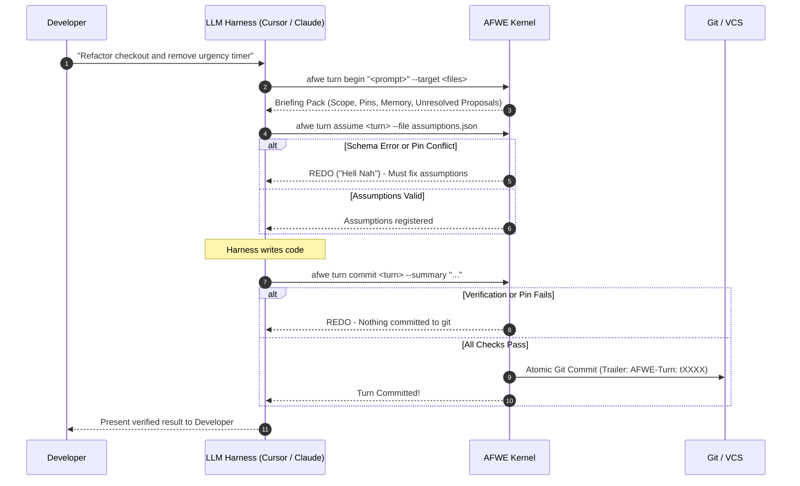

# AFWE Developer Tutorial: Zero to Mastery

Welcome to AFWE (**Architecture-First Workspace Engine**). This tutorial takes you step-by-step through configuring and using AFWE on any project, understanding how the turn protocol guarantees determinism with AI coding agents, and using guardrails, pins, and recovery mechanisms.

---

## 1. Core Philosophy: The Folder is the Product

Modern AI coding agents (Claude Code, Cursor, Codex, OpenCode) suffer from **silent collateral damage**:
- In Turn 1, the agent builds a billing integration.
- In Turn 15, the agent refactors a UI component and accidentally breaks the billing data contract.
- Line numbers drift, memories fade from agent context windows, and codebases slowly rot.

**AFWE solves this deterministically**:
- It sits between your harness and the codebase.
- Everything lives in `.afwe/` in human-readable, git-friendly YAML and markdown.
- **Zero LLMs in core**: AFWE never makes internal model calls. The harness is the model, and AFWE is the deterministic verification kernel.

```text
Developer Prompt ──▶ Harness (Claude / Cursor) ──▶ AFWE Turn Protocol ──▶ Verified Git Commit
```

---

## 2. Onboarding: Initializing a Project

Setting up AFWE takes one command:

```bash
afwe onboard --profile engineer
```

What `afwe onboard` does automatically:
1. Detects your tech stack (Rust, TypeScript/Node, Python, Go, etc.).
2. Creates `.afwe/` with `afwe.yaml`, `blueprint/`, `memory/`, and `guardrails/`.
3. Scaffolds an initial structural blueprint tree from your folder layout.
4. Appends the non-negotiable contract block to `AGENTS.md` (and `CLAUDE.md`).
5. Configures your profile:
   - `normie`: Auto-commits turns when verification passes.
   - `engineer`: Stages passing turns for manual `git commit` review.

You can inspect your project status at any time:
```bash
afwe status
```

---

## 3. The Non-Negotiable Turn Protocol

Every prompt given to an AI agent is a **Turn**. The harness wraps every single coding request in 3 deterministic steps:



### Step 1: `afwe turn begin`
Before writing code, the harness calls `turn begin`. AFWE returns a **Briefing Pack** containing:
- In-scope architectural nodes and files.
- **Active Pins**: Human decisions locked against modification.
- **Memory & Rules**: Relevant architectural decisions, terminology, and constraints.
- **Unresolved Proposals**: Pending staged changes.

### Step 2: `afwe turn assume`
The harness declares what it intends to touch and its pre-generation claims:
```json
{
  "intents": [
    {
      "id": "remove-timer",
      "action": "update",
      "targets": ["checkout"],
      "statement": "Remove countdown clock from checkout screen"
    }
  ],
  "assumptions": [
    {
      "id": "a1",
      "text": "Checkout contains no ticking-clock component",
      "claim": {
        "type": "forbid_pattern",
        "pattern": "ticking-clock",
        "files": ["src/checkout/**"]
      }
    }
  ]
}
```
If an assumption violates a locked Pin or has an invalid schema, AFWE returns **REDO** ("Hell Nah") and stops the harness before any code is generated.

### Step 3: `afwe turn commit`
After writing code, the harness calls `turn commit`.
AFWE's gate runs parser checks, verifies claims, and inspects imports.
- If checks fail: **REDO** — nothing is committed to git.
- If checks pass: The change is committed with trailer `AFWE-Turn: tXXXX`.

---

## 4. Protecting Decisions with Pins

Pins are human-locked invariants that agents cannot override without explicit permission.

### Creating a Pin
```bash
# Lock a critical invariant
afwe pin add "Payments must never call UI or frontend components" --node payments --severity block

# Propose an intentional marker (e.g. intentional temporary behavior)
afwe pin add "Allow mock token in dev environment" --node auth --severity confirm --intentional
```

### Pin Budgets
To prevent pin sprawl, AFWE calculates a budget derived from your codebase size:
```bash
afwe pin budget --slider 3
```
- Slider 1: Relaxed (fewer pins enforced).
- Slider 3: Balanced.
- Slider 5: Strict.

If an agent attempts to touch a pinned invariant, the gate triggers a **REDO**:
```text
REDO — t0004 NOT committed
  ✖ PIN_CONFLICT: pin pin-5babbe protects node afwe-core
```
To proceed, the agent must provide an explicit `--override pin-id="reason"` justification.

---

## 5. Guardrails: What You Control vs What the Agent Controls

| Guardrail Type | Who Controls It | How It Works |
| --- | --- | --- |
| **Passive Guardrails** (`.afwe/guardrails/passive/*.yaml`) | **Human** | Rendered into context whenever an agent touches matching files or nodes. Example: *"Widgets must work behind corporate proxies."* |
| **Active Guardrails** (`.afwe/guardrails/active/*.yaml`) | **Human & CI** | Executed deterministically on `afwe verify` and `turn commit`. Enforces AST rules: `forbid_import`, `forbid_pattern`, `require_pattern`, `require_file`, `command`. |
| **Living Intents** (`.afwe/intents/*.yaml`) | **Agent-First** | Created and updated by the harness on each turn. Captures the living DAG of features being designed and implemented. |
| **Memory** (`.afwe/memory/decisions/*.md`) | **Human & Agent** | Persisted architectural decisions, exceptions, and terminology. |

---

## 6. Building for the Future: Planned Architecture

You can plan architectural evolutions without failing current builds:

```bash
# Add a planned node
afwe blueprint add "billing-v2" --parent payments --status planned

# Add a forward-looking constraint
afwe blueprint constrain billing-v2 --must-not-depend legacy-db --planned --why "Decouple from legacy schema"
```

- **Exempt from False Drift**: Planned nodes never trigger missing-file drift warnings.
- **Non-blocking Warnings**: Planned constraints are displayed as `[PLANNED DIRECTION: non-blocking]` in context briefings, giving agents context on where the architecture is heading without blocking pre-commit gates.

---

## 7. Recovery & Timeline: 3-Way Feature Restoration

Every committed turn is indexed by intent. You can view project history at any time:
```bash
afwe timeline
```

```text
history via git · 3 turn(s)
t0003   committed  1a8af03  deterministic 100%  docs: document futures engine...
t0002   committed  a6efb21  deterministic 100%  feat: support architectural directions...
t0001   committed  f65ea39  deterministic 100%  add multi-intent-funnel stress test...
```

### Restoring a Feature Lost by an Agent
If prompt 14 accidentally stripped a feature added in prompt 3:
```bash
# Preview what would be restored
afwe timeline restore my-feature

# Apply 3-way merge restoration
afwe timeline restore my-feature --apply
```
AFWE executes a true 3-way merge against the last good commit, opens a new turn, and stages the restoration cleanly.
