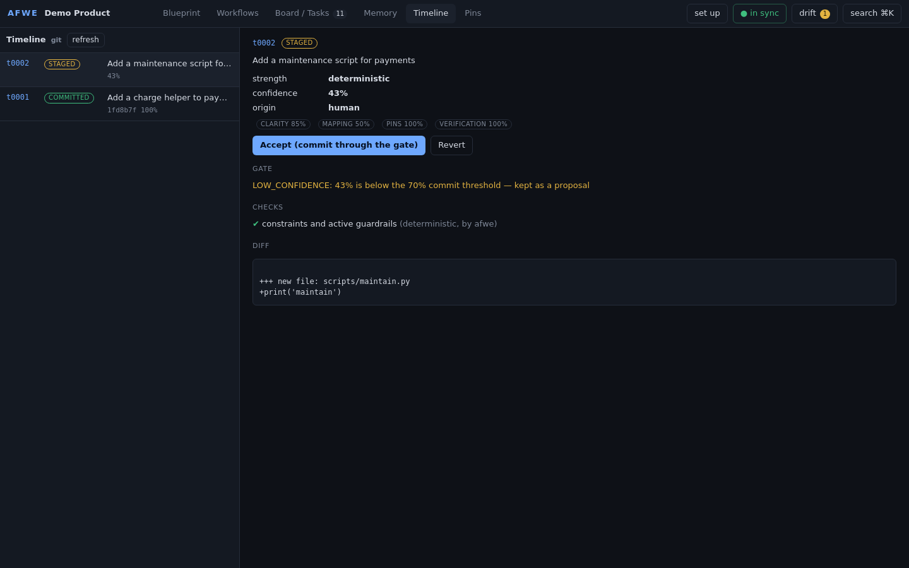

# AFWE - Architecture-First Workspace Engine

> **The folder is the product.** `.afwe/` is a persistent, multi-level, two-way model of a codebase that
> sits between an LLM harness (Claude Code, Codex, Cursor, …) and the IDE. Rust + tree-sitter + Tauri is
> just the machine that reads and writes it — the engine is replaceable, the format is the artifact.

```
harness (agent loop)  ──MCP / CLI──▶  afwe engine  ◀──reads/writes──▶  .afwe/  ◀──renders/edits──  Studio (Tauri / web)
        │                                  │
        └──────── edits code ──────────────┴──── tree-sitter analysis ────▶  your source tree
```

AFWE is **not** a harness: it never owns the agent loop. It tells the harness what it needs (contracts),
answers "what applies to what I am touching?" (passive guardrails), refuses what breaks the architecture
(active guardrails), and keeps the blueprint and the code honest with each other (drift + confidence policy).


## What lives in `.afwe/`

| Path | What it is | Who writes it |
| --- | --- | --- |
| `afwe.yaml` | manifest: project, analyzer config, confidence policy, provenance policy | human / init |
| `blueprint/blueprint.yaml` | **Blueprint** — deterministic structural reality: tree of nodes, purpose, implementation mapping (files / globs / symbols) | human, agents, sync |
| `blueprint/relations.yaml` | declared relationships (`depends_on`, `uses`, …) with rationale, status `declared` / `inferred` | human, agents, sync |
| `blueprint/constraints.yaml` | structural rules: `must_not_depend`, `may_depend_only` ("Payments may depend on Identity but must not depend on UI") | human, agents |
| `memory/{decisions,constraints,exceptions,terminology,problems}/*.md` | **Memory** — knowledge as markdown with YAML scope (`applies_to` nodes, `files` globs, `symbols`, `tags`) | human, agents |
| `guardrails/passive/*.yaml` | statements + scope + exceptions that get inserted as micro-context | human, agents |
| `guardrails/active/*.yaml` | checks (`forbid_import`, `forbid_pattern`, `require_pattern`, `require_file`, `command`) enforced by `afwe verify` | human, agents |
| `workflows/*.yaml` | **Node-based workflows** — desired structure/behaviour, frozen in time, `origin: human / llm:<name>`, prompt kept as provenance | human, agents |
| `abstractions/*.yaml` | **Lenses** — regroup / re-root the blueprint view, zero codebase impact, may include workflows | human, agents |
| `contracts/*.yaml` | scoped instructions that tell the harness what AFWE needs (`default` coding contract, `architecture` contract) | human |
| `index/` | derived retrieval index (nodes ⇄ files ⇄ symbols ⇄ memory); `code.json` is git-ignored | engine |
| `state/` | drift findings, proposals, board (tasks + obligations), sync fingerprints | engine |
| `log/changes.jsonl` | append-only change log with origin and confidence | engine |

**Memory files = knowledge. Index = location/retrieval. Code = implementation.**
Identity is *file path + symbol identity + structural (AST) path + content fingerprint* — never line numbers,
so renames and moves are recognised instead of breaking references.

## The turn protocol (v2)

Every prompt is a **turn**. AFWE never calls a model; the harness does, and AFWE wraps it in three deterministic
steps. Nothing is committed unless the gate passes.

```text
turn begin  "Let checkout show the button" --target payments   → briefing: scope, PINS, intents, memory,
                                                                 registered checks, unresolved proposals
turn assume t0002 --file intents.json                          → intents + claims BEFORE the code (REDO on
                                                                 schema errors or pin conflicts)
   …harness writes the code…
turn commit t0002                                              → COMMIT (git, AFWE-Turn: t0002 trailer)
                                                                 | STAGE (proposal, uncommitted)
                                                                 | REDO (the reasons; nothing committed)
timeline / timeline restore <feature> / timeline losses        → history indexed by intent
```

What the gate checks, in order: constraints and active guardrails on the changed files, pins (a *block* pin
refuses the change, a *confirm* pin stages it), collateral loss (a feature that disappeared without being
declared in `removes`), assumption claims, and every registered check whose scope the turn touches. Confidence
below 70 % stages the turn as a proposal; the footer tells you about it until you accept or revert it.

Pins are human-locked decisions. Say "keep it like that" and AFWE proposes a pin; "intentional" proposes an
intentional-bug marker, so "fix all bugs" leaves it alone. The number of active pins is bounded by the size of
the blueprint and the manual slider (`afwe pin budget --slider 1..5`). See `docs/V2-DECISIONS.md`.

## Building for the future (Architectural Directions)

Developers and agents can declare where an architecture is headed before writing code:
- **Planned Nodes**: Blueprint nodes support `status: planned`. They are exempted from missing-file drift warnings so future architecture does not trigger false alerts.
- **Planned Constraints**: Constraints support `phase: planned` (e.g. `afwe blueprint constrain billing --must-not-depend db --planned`). These forward-looking rules are highlighted in turn briefings and `afwe context` queries as architectural directions, but do not fail verification gates or block pre-commit checks.
- **Planned Roadmap**: Upcoming capabilities like First-Class Project Scoping (`exclusions-engine`: `afwe ignore add/remove/list`) and 4D Temporal Scrubbing (`timeline-snapshot`) are mapped directly as planned components in the blueprint.

## Quick start

```bash
# build the engine (Rust 1.75+). The Studio frontend is pre-built in apps/studio/web-dist and embedded.
cargo build --release            # → target/release/afwe

cd your-project
afwe init --name "My Product" --agents-md      # empty .afwe/ (+ contract block in AGENTS.md / CLAUDE.md)
afwe blueprint add Payments --kind subsystem --purpose "Charging users" --files 'src/payments/**'
afwe blueprint add Identity --purpose "The User model everyone shares" --files 'src/identity/**'
afwe blueprint relate Payments Identity --why "charges are per user"
afwe blueprint constrain Payments --must-not-depend UI --why "runs headless in workers"
afwe memory add decision "Sessions expire after 24h" --applies-to Authentication --tags auth
afwe sync                        # analyse code, build index, reconcile drift by confidence
afwe context src/payments/checkout.ts   # what an agent gets before touching that file
afwe verify --changed src/payments/checkout.ts   # exit 1 on violations
afwe onboard --profile normie    # git, CI gate, AGENTS.md, profile (idempotent)
afwe turn begin "Add tagging to search" --target src/workspace/**   # briefing for the harness
afwe turn commit t0001           # gate, then commit with the AFWE-Turn trailer (or stage / REDO)
afwe gate                        # whole-project gate (what CI runs)
afwe studio                      # Studio in the browser (http://localhost:4242)
afwe mcp                         # MCP server on stdio for your harness (49 tools)
```

For an already-populated example: `cd examples/demo-project && afwe status` (see its README).

## Documentation & Guides

- **[Developer Tutorial (Zero to Mastery)](docs/TUTORIAL.md)**: Interactive walkthrough covering onboarding, turn protocol, pin management, planned futures, and 3-way timeline feature restoration.
- **[Real-World Case Study (Multi-Intent Funnel)](docs/WALKTHROUGH.md)**: Step-by-step case study showing how AFWE decomposes complex qualitative prompts into AST claims and protects against collateral damage without LLMs in core.
- **[Architecture Specification](docs/SPEC.md)**: Format specification of the `.afwe/` product folder.
- **[V2 Decisions & Kernel Refinements](docs/V2-DECISIONS.md)**: In-depth technical rationale on turn ledger, gate mechanics, and pin sliders.

### Blueprint (structural reality)
Tree of nodes (`product → subsystem → module → component …`) with *purpose* ("why does it exist"),
implementation mapping and relations. Every file/symbol in the codebase resolves to exactly one node
(or shows up as **unmapped** drift). Edit it from the CLI, from an agent, or by dragging nodes in the Studio.

### Node-based workflows (desired behaviour)
Opal/ComfyUI-style graphs: `prompt → intent → design → step → component`, arbitrary depth, many in parallel,
each node with `origin`, `status`, `maps_to` (where it landed). The original prompt is kept verbatim as a
`prompt` node (`provenance.retain_prompts: true`) — the persisted thing is structured knowledge, not the chat.
`afwe workflow promote` turns component nodes into *planned* blueprint nodes.

### Lenses (custom abstractions)
"Show me the workspace as Library / Search / Preview / Tagging" — a lens regroups existing nodes under
virtual groups (and can attach workflows). Nothing in the code or blueprint changes.

### Memory + index
Five kinds of knowledge, each a markdown file with scope metadata. The index answers
"which decisions apply to `src/dashboard/Widget.tsx`?" without the agent reading everything.
Memory can be scoped to nodes, file globs, symbols, tags or the whole project, and can say what it
`enforces` (a constraint) or `supersedes`.

### Guardrails
Orthogonal to the tree: attach to nodes, relations, lenses, tags or file regions.
* **passive** — inserted into `afwe context` as micro-context (statement, reason, exceptions and *where the
  exceptions apply*, e.g. "no WebSockets in Dashboard — except realtime widgets").
* **active** — `afwe verify` runs them and fails: forbidden imports between nodes, forbidden/required
  patterns, required files, arbitrary commands (`npm test -- {files}`) when files in scope change.

### Contracts, Board, Tasks
`contracts/default.yaml`: *context → implement → verify → update memory/architecture → sync → log*.
`contracts/architecture.yaml`: *intent → node workflow → blueprint → implement → verify → update → sync → log*.
`afwe task start` opens a task on the Board with one obligation per step; the engine ticks them off as the
agent calls `afwe_context`, `afwe_verify`, `afwe_memory_add`, `afwe_sync`, `afwe_task_done` …
`afwe contract render` prints the block for `AGENTS.md` / `CLAUDE.md`.

### Drift and the confidence policy
`afwe sync` re-analyses the code and compares it with the blueprint. It **detects disagreement and never
invents agreement**:

| confidence | behaviour |
| --- | --- |
| ≥ 70 % | auto-reconcile + log |
| 50 – 70 % | auto-reconcile if nothing contradicts it, log with an *uncertainty marker* (Board item that stays until you `afwe board dismiss <id>` it) |
| < 50 % | **proposal** — `[Accept] [Revert] [Review impact]` in the Studio / `afwe proposals` |

Graph and files are two views of the same data; the Studio, `afwe status` and `afwe context` all warn
when they are out of sync.

## Studio

The Studio has a **Timeline** (every turn with its status, confidence and diff; accept or revert a staged proposal;
restore a feature that disappeared), a **Pins** view (accept or retire pins, move the strictness slider, see the
intents and the registered checks), and a **set up** wizard that shows what it will write before it writes it.



`afwe studio` (web, embedded in the binary) or the Tauri v2 desktop app in `apps/studio/src-tauri`.
Same React frontend, same engine, one API call (`call(op, params, origin)`).

* top bar — project · **Blueprint / Workflows / Board·Tasks / Memory** · sync state · drift · search (⌘K)
* left — architecture tree (main blueprint or a lens)
* centre — architecture graph: containment, declared / inferred / undeclared (code-only) / **violating** edges,
  drag a node onto another to move it, connect two nodes to declare a relation, double-click to expand
* right — context panel: *What is this · Why does it exist · What contains it · What depends on it ·
  What implements it · What constraints apply · What decisions apply · Guardrails*, plus an **Agent view**
  showing exactly the micro-context an agent would receive
* bottom — Zoom · Expand · Collapse · Show Implementation · Verify · Sync

| | |
| --- | --- |
|  |  |
|  |  |

## Harness integration

* **MCP** (recommended): `afwe mcp` exposes `afwe_context`, `afwe_verify`, `afwe_sync`, `afwe_blueprint_edit`,
  `afwe_memory_add`, `afwe_workflow_upsert`, `afwe_task_start`, … — see [docs/INTEGRATION.md](docs/INTEGRATION.md)
  for Claude Code / Codex / Cursor configuration and hook examples.
* **CLI**: every op is also `afwe <command>` or raw `afwe call <op> '<json>'`; `--json` everywhere;
  `--origin llm:<name>` records who changed what.

## Languages

tree-sitter grammars for TypeScript / TSX / JavaScript / Python / Rust / Go / Java (symbols, imports,
structural identity, exports). Other languages (C, C++, C#, Ruby, PHP, Kotlin, …) are still indexed at file
level with regex import detection, so mapping, drift and guardrails work everywhere; adding a grammar is a
one-line `LangSpec` in `crates/afwe-core/src/analyze/langs.rs`.

## Repository layout

```
crates/afwe-core     engine: schema, store, analysis, mapping, index, context, verify, drift, sync, ops, api,
                     v2: turn (protocol), intent (intents, pins, checks, checkgen), gate, conflict, claims,
                     vcs (trait + git), timeline (history, losses, restore), onboard
crates/afwe-cli      `afwe` binary: CLI, MCP server (stdio), web Studio host (embeds apps/studio/web-dist)
apps/studio          React + React Flow Studio (Vite) · src-tauri = Tauri v2 desktop shell (own workspace)
examples/demo-project  a populated .afwe/ (format afwe/2) with drift, a violation, pins, a lens and an intent
docs/                SPEC.md (format) · ARCHITECTURE.md (engine) · CONTRACTS.md · INTEGRATION.md · screenshots/
scripts/             build.sh (frontend + release binary) · dev.sh (Vite + engine API) · demo.sh (CLI + turn-protocol tour)
```

## Tests

```bash
cargo test            # unit tests (gate, conflicts, claims, pin budget, timeline, onboarding, analyzer, mapping),
                      # end-to-end tests (crates/afwe-core/tests/end_to_end.rs) and turn-protocol tests against
                      # real git (crates/afwe-core/tests/turn_flow.rs)
scripts/demo.sh       # a tour of the shipped demo, then the turn protocol on a throw-away git copy
```

The turn-protocol tests walk the whole loop through the same `api::call` surface the CLI, MCP server and Studio use:
a committed turn with a claim that becomes a standing check; a REDO for a boundary violation (nothing committed),
then a fix; collateral loss refused, then declared and committed; a restore by 3-way merge; a block pin refusing an
edit, then overridden with a reason; a staged proposal that is folded into a later turn behind the footer; revert;
the whole-project gate.

## Status

v2 is the engine described in `implementation_plan_arena.md`, with the refinements in `docs/V2-DECISIONS.md`
(what changed, why, what was verified, and the decisions to confirm). Not built yet: the 50-prompt benchmark, a 3D
view of history, LLM-judged check runners, harness-specific hook installers, and the Tauri desktop build (it needs
webkit2gtk). Licence: MIT.
